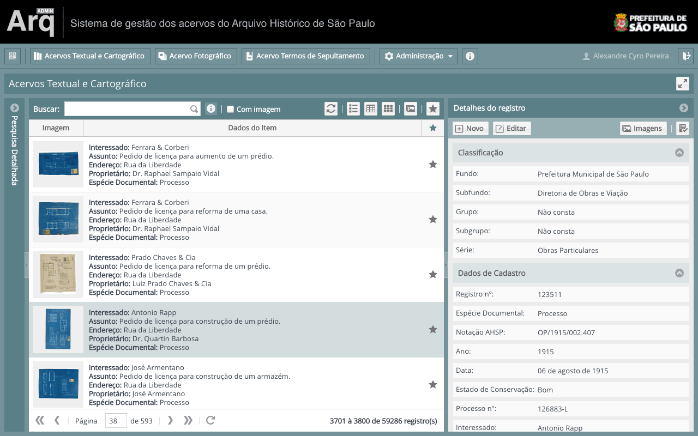

# ArqAdmin Client

> Aplicação cliente do Sistema de Gestão dos Acervos do [Arquivo Histórico Municipal](http://arquivohistorico.sp.gov.br) de São Paulo.

O ArqAdmin é o sistema de gestão dos acervos do Arquivo Histórico Municipal de São Paulo.

Esta é a Aplicação Web cliente para gerenciamento do acervo, através da API do [ArqAdmin Server](https://github.com/cyrlx/arqadmin-server).

Este sistema foi desenvolvido com o framework Javascript ExtJS. A documentação pode ser encontrada em [http://docs.sencha.com/extjs/5.1.1/](http://docs.sencha.com/extjs/5.1.1/).

## Demo

Screenshots: [docs/screenshots.md](./docs/screenshots.md)

## Créditos

[Alexandre Cyro](https://github.com/cyrlx) - [@alexandrecyro](https://twitter.com/alexandrecyro)

## Licença

Open Source GPL 3.0 license.

http://www.gnu.org/licenses/gpl.html
