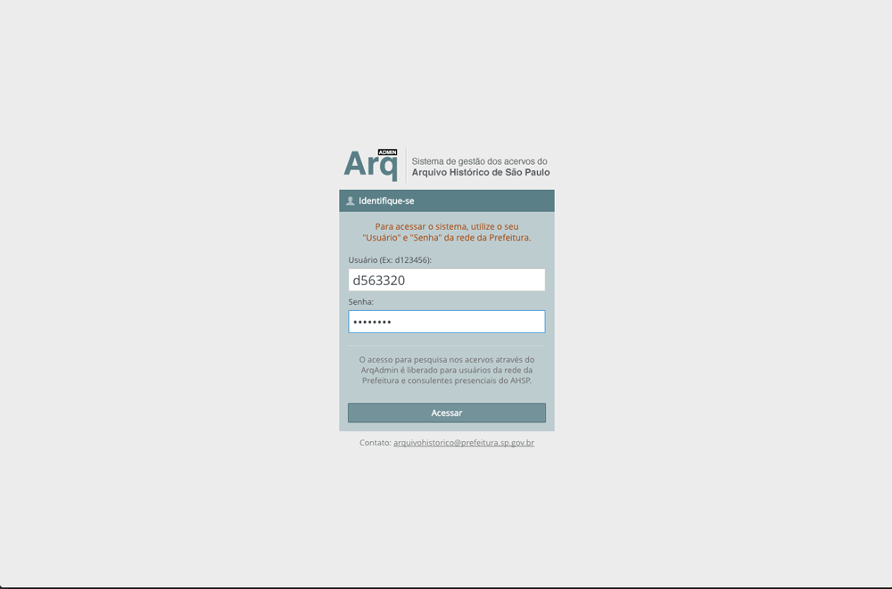
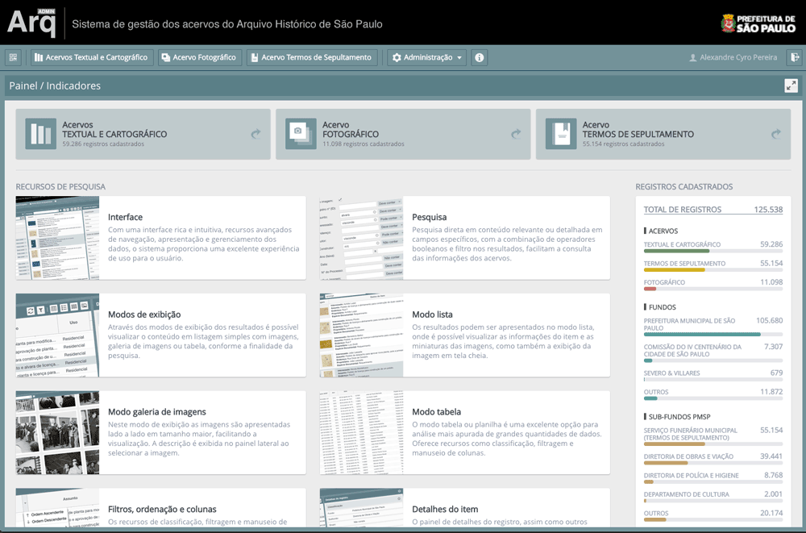
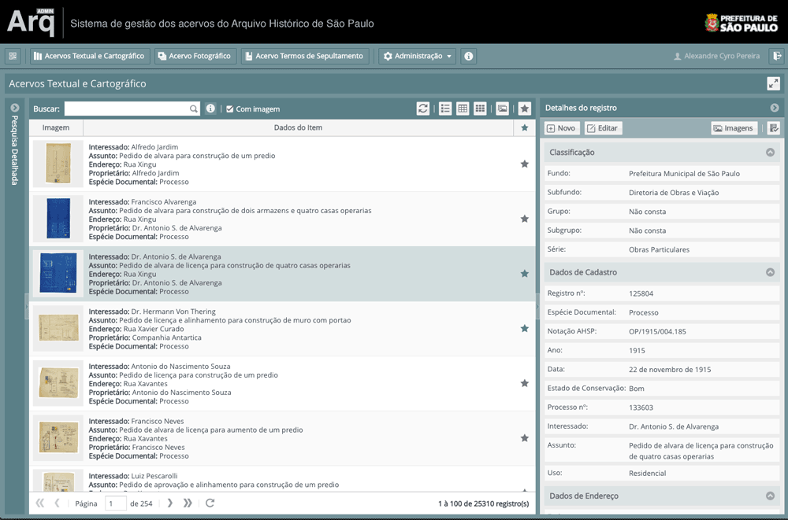
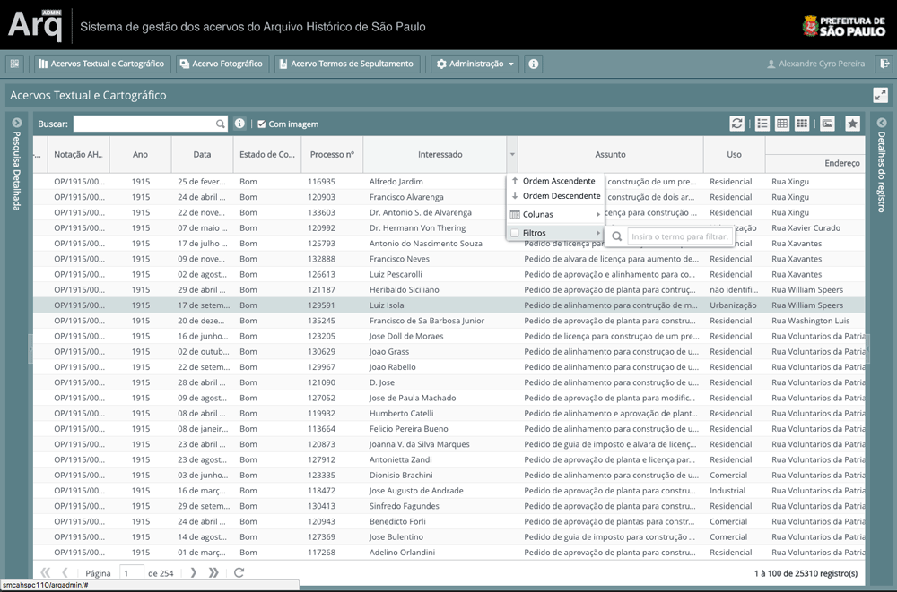
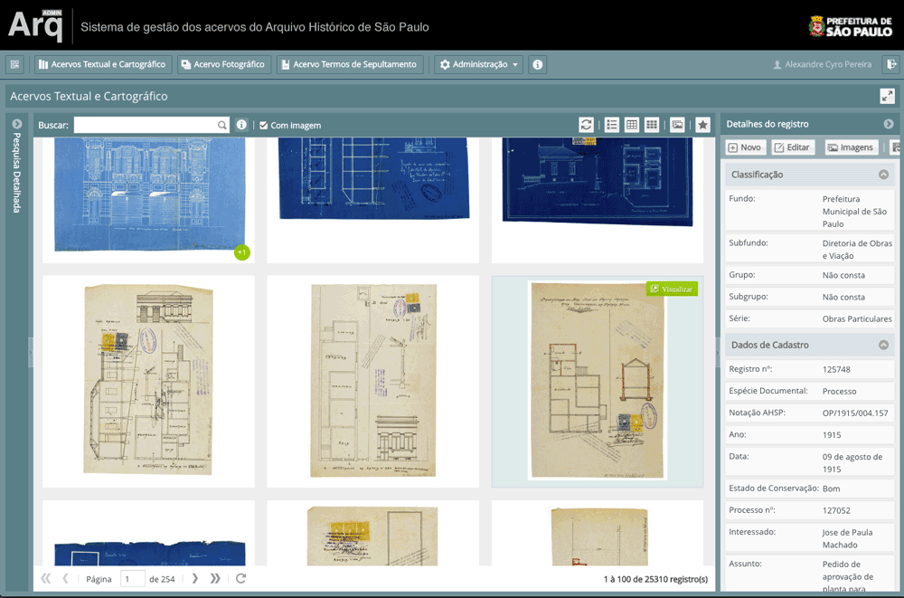
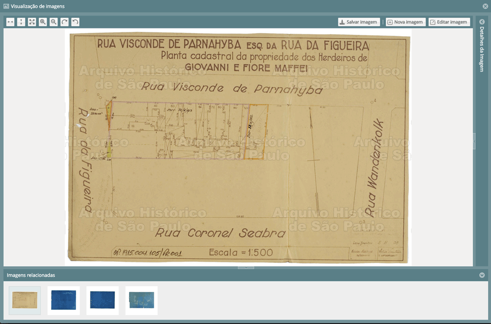
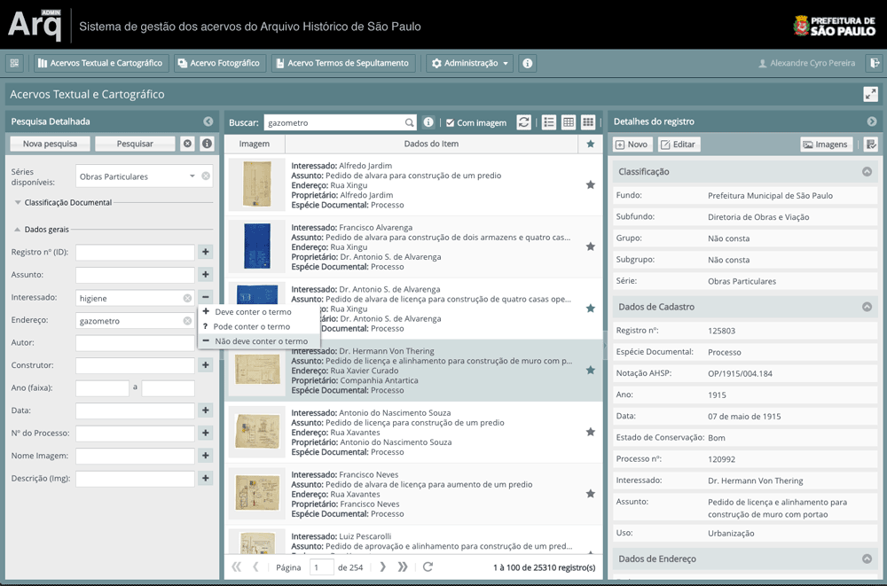
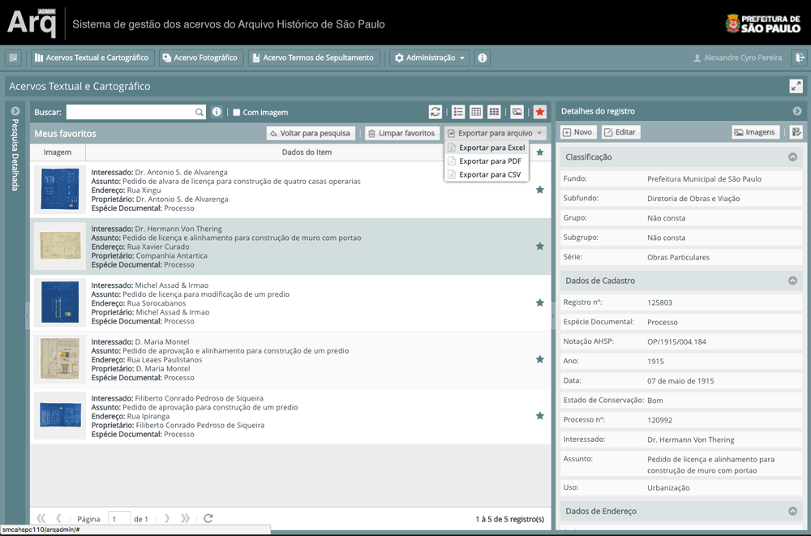
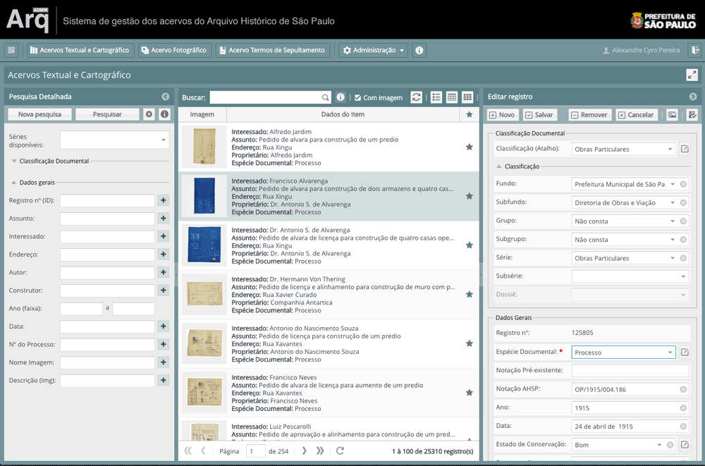
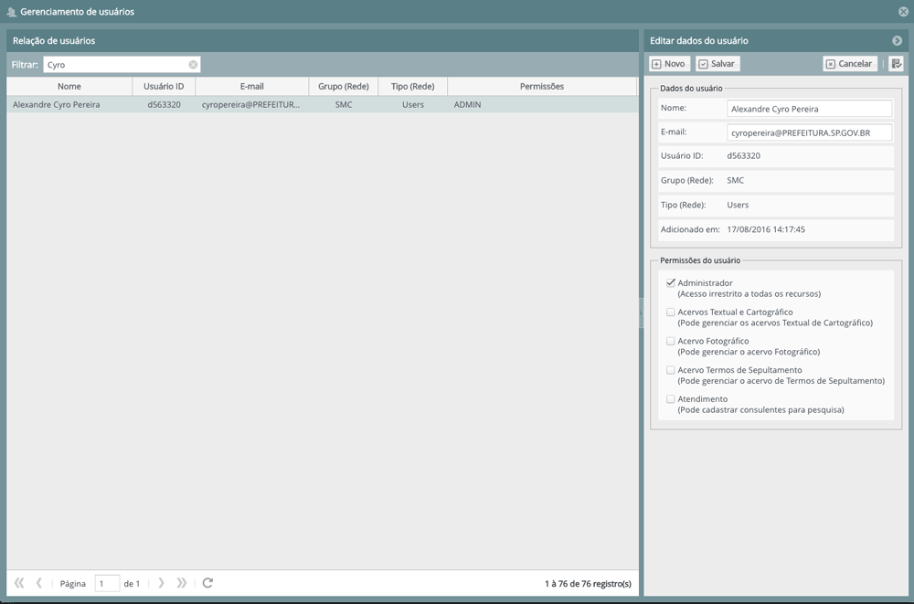

# Screenshots do [ArqAdmin Client](https://github.com/cyrlx/arqadmin-client)

> Algumas telas do ArqAdmin Client.

Login integrado com a rede Active Directory.

Painel de indicadores (Dashboard).

Visualização dos itens em lista com painel de detalhes do item selecionado.

Visualização dos itens em tabela, com opções de filtro nos resultados, ordenação e exibição personalizada de colunas.

Visualização dos itens em galeria de imagens.

Visualização de imagens com controles de exibição como ampliação, rotação e posicionamento, e download da imagem com conversão para tamanhos personalizados.

Pesquisa simples ou avançada

Seleção de itens favoritos com opção de exportação em planilha Excel, PDF ou CSV

Formulário de edição dos metadados e dados estáticos (auxiliares), com recursos de validação, versionamento de edição e upload de imagens.

Gerenciamento de usuários com papeis específicos para edição dos dados.

